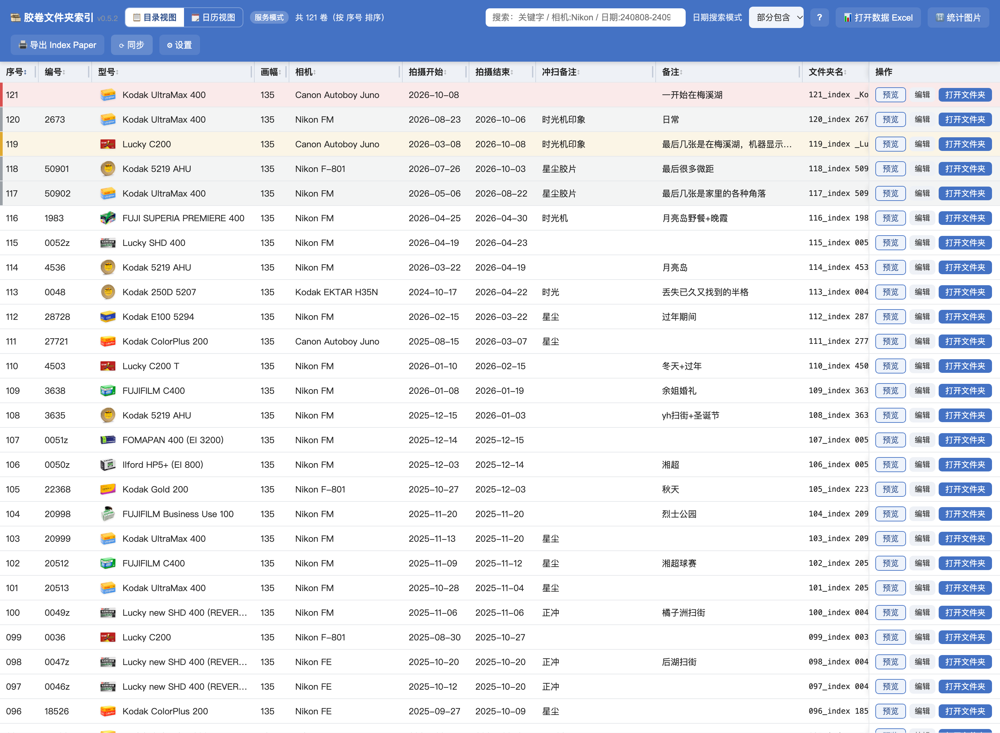
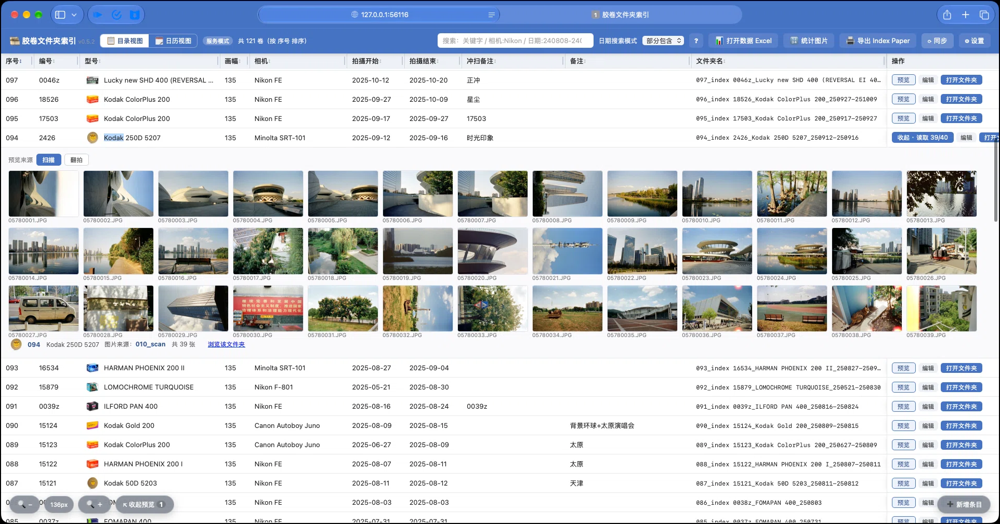

# 胶卷索引页面 (film-index-page)

> 一个本地运行、用 Excel 当数据库、用浏览器当界面的胶卷整理与索引工具。
> **数据不上传、不联网，全部存在你自己的硬盘里。**

当前版本 **v0.5.2**　·　仅非商业使用（见 [LICENSE](LICENSE)）　·　macOS 已完整测试，Windows 可用

---

## 这是什么

拍完胶卷之后最麻烦的是整理：这一卷是哪台机拍的、什么时候拍的、冲到哪一步了。
这个工具就是干这个的——把每一卷收进一张表，用文件夹名串起硬盘上的照片。

**纯 Python 标准库 + 单文件前端**，没有第三方依赖、没有构建步骤，下载就能跑。

## 功能

| 功能 | 说明 |
|---|---|
| 📋 目录视图 | 一卷一行：序号、编号、型号、画幅、相机、拍摄起止、备注、文件夹名。点表头排序，列可显示/隐藏/调顺序 |
| 🎞 胶卷图标 | 内置 213 款胶卷型号的实物图，目录视图每条左边显示，型号下拉框也带图标 |
| 🔍 悬停高清 | 鼠标停在图标上，弹出该胶卷的高清大图（只在悬停时加载，不拖慢列表）|
| 🗓 日历视图 | 按拍摄时间把每卷画成一条横条，可按相机分道，周视图 / 月视图随意切 |
| 🖼 整卷预览 | 点「预览」看整卷缩略图；点开可放大、拖拽、旋转、下载原图 |
| 🎬 拍摄状态 | 拍摄中 / 待冲洗 / 冲洗中 / 待归档 / 已归档，整行上色，颜色可改 |
| 🔍 搜索 | 关键字、`列:值`、`-排除`、日期范围，多个条件空格隔开 |
| 📁 文件夹自动化 | 改了编号/型号/拍摄日期，保存时自动同步硬盘上的文件夹名；新增条目可一键创建文件夹 |
| 🖨 Index Paper | 勾选胶卷批量导出可打印的 docx，每卷一张索引页 |

## 截图






## 下载 / 安装

**国内下载（坚果云，推荐）**：https://www.jianguoyun.com/p/DSKDf6cQ07D8CxjElasGIAA

1. 解压得到的 `000_胶卷索引信息` 文件夹，**放进你的胶卷根目录**（里面是各个 `xxx_index ...` 胶卷文件夹）
2. **macOS**：双击 `010_启动Mac.command`
   **Windows**：双击 `011_启动Win.bat`
3. 浏览器会自动打开界面；首次运行会用 `assets/template.xlsx` 自动生成一份空白数据库

> Windows 上如果打开预览较慢，是缩略图在首次生成；第二次打开会快很多。

## 目录结构

```
000_胶卷索引信息/
├── 010_启动Mac.command        启动脚本（macOS）
├── 011_启动Win.bat            启动脚本（Windows）
├── 030_手动更新索引.command   手动重建快照
├── 031_手动更新索引.bat
├── 使用说明.txt / .html
└── assets/
    ├── worker.py              后端：快照 / 本地服务 / 缩略图
    ├── build_html.py          前端生成器 → index.html
    ├── index.html             生成好的页面
    ├── template.xlsx          空白数据库模板（首次运行自动复制成 films.xlsx）
    ├── index_template.docx    Index Paper 的 docx 模板
    ├── film_icons/            型号图标（96×77，列表用）
    └── film_icons_hd/         型号图标高清母版（悬停预览用）
```

**你自己的数据**（不进版本库）：`films.xlsx`、`snapshot.json`、`settings.json`、`log/`、`backup/`
这些都在 `.gitignore` 里排除了。

## 胶卷图标来源

`assets/film_icons/` 与 `assets/film_icons_hd/` 里的实物图为**整理自互联网的产品图**，
已做统一裁切与透明底处理，仅用于型号识别展示。若相关权利人提出异议会立即移除。

其余代码为原创。

## 许可

**仅限非商业使用。** 禁止出售、禁止用于付费服务、禁止随商业产品分发。
个人 / 学习 / 研究 / 教学用途完全免费。

详见 [LICENSE](LICENSE)。如需商业授权请联系作者。

本软件按「现状」提供，不附带任何担保；作者不对使用造成的损失负责，也不承诺维护与更新。
